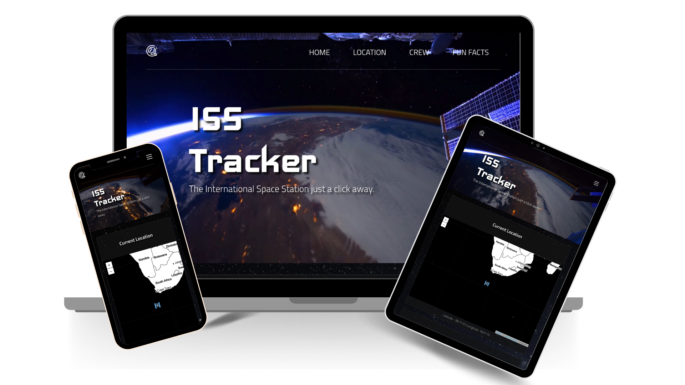

# Projeto ISS Tracker


  O ISS Tracker é um site desenvolvido para rastrear a ISS (International Space Station) em tempo real e algumas outras funcionalidades, tais como:
  - Localizar a Estação Espacial em tempo real e exibi-la em um mapa.
  - Exibir uma lista com a tripulação atual a bordo.
  - Trazer algumas curiosidades sobre a Estação Espacial.

  O objetivo do seu desenvolvimento foi praticar as habilidades de Front-end e Design Responsivo utilizando React, CSS e Media Queries.
  
  Você pode acessá-lo <a href="https://johntvale.github.io/project-iss-tracker/">clicando aqui.</a> :artificial_satellite: :rocket: :smile:

---

### Habilidades desenvolvidas
- Criação e manipulação componentes funcionais (React Functions)
- Criação e manipulação componentes genéricos
- Utilização de React Hooks
- Especificação de PropTypes
- Mapeamento de Componentes
- Consumo de API's utilizando Fetch
- Gerenciamento de dados com Context API
- Utilização de links internos e externos
- Utilização de Media Queries para criar responsividade
- Detecção de rolagem e redimensionamento

---

### Tecnologias utilizadas
- React
- Context Api
- CSS
- NPM
- Eslint

---

### Instalação e Execução
- Abra o terminal dentro do diretório onde deseja armazenar o projeto e execute o comando abaixo:
  ```
  git clone git@github.com:johntvale/project-iss-tracker.git
  ```

- Entre no diretório project-iss-tracker
  ```
  cd project-iss-tracker/
  ```

- Instale as dependências do projeto
  ```
  npm install
  ```

- Após a conclusão da instalação, execute o projeto com o comando abaixo:
  ```
  npm start
  ```

### Referências
- Vídeo do Background foi retirado do canal no YouTube: <a href="https://www.youtube.com/watch?v=FG0fTKAqZ5g">David Peterson</a>
- Projeto inspirado no site oficial da <a href="https://www.nasa.gov/">NASA</a> e nas aulas do mestre <a href="https://github.com/icaroharry">Ícaro Harry</a>
